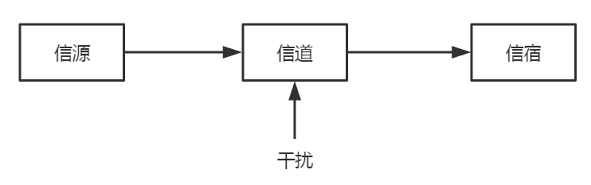
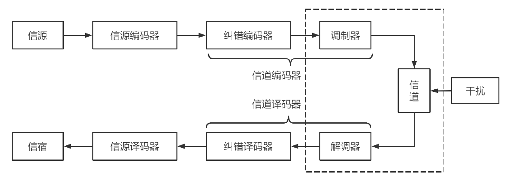
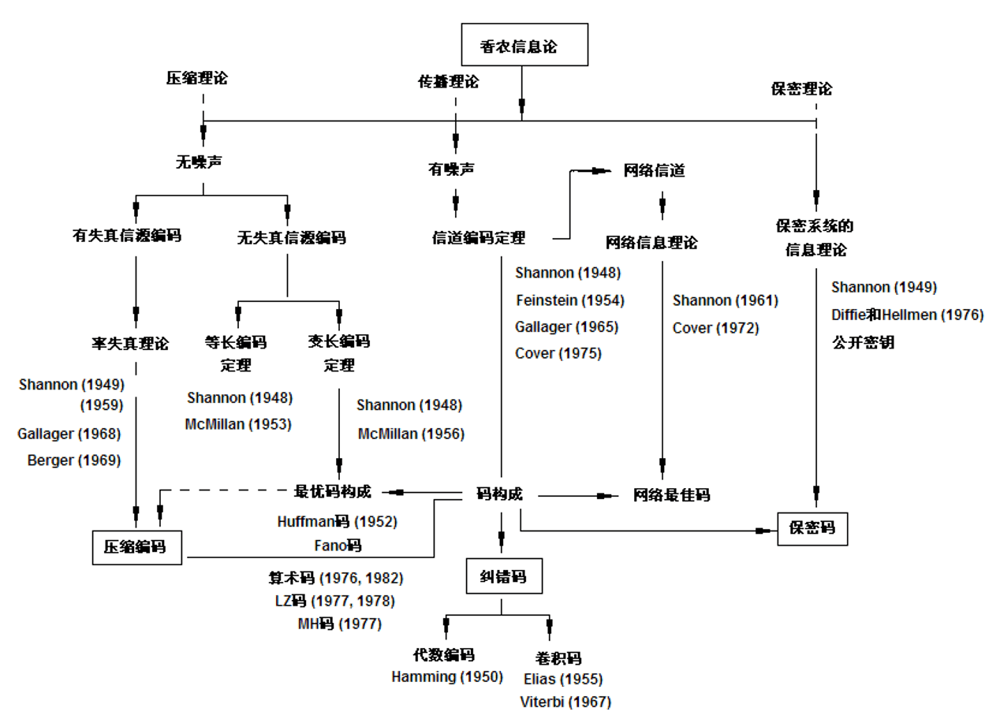

# 第 1 章 绪论

## 什么是信息？

### 信息的重要性

在我们具体给出信息的定义之前，我们还是先强调一下信息的重要性，这个重要性我们可以从两个方面来说明。

首先，信息是普遍存在的，大家可以举出很多信息的例子。其实大家仔细去观察会发现我们从早到晚都在接触各种各样的信息，关于这个问题在佛法上面有很精辟的说明，佛法将人和宇宙分为两个部分：色法和心法，色法就是我们现在说的物质，心法就是我们现在说的精神，也就是说人和宇宙都是由物质和精神组成的，物质是有形的，精神是无形的。对于人来说色法又称为身，因此我们常说人的身心世界，就是指的构成人的物质世界和精神世界。有待补充……普遍存在的当然重要了，说明我们时时刻刻都不能离开信息，或者说信息无时无处不在发挥作用。

其次，材料科学、能源科学和什么科学（信息科学）称为现代科学的三大支柱。科学家给出的评论：“没有物质的世界是什么样（虚无）的世界，没有能源的世界是什么样（死寂）的世界，没有信息的世界是什么样（混乱）的世界。”可见信息很重要，随着社会信息化的加速，人们越来越依赖信息。

### 信息的定义

好，既然信息这么重要，看来我们确实有必要去认识一下什么是信息。大家知道信息是什么吗？你能够给信息下一个定义吗？

好像我们从来都没有思考过这个问题，看来越重要的东西往往我们越容易忽视。信息的定义非常广泛，不同的定义有百种以上，不同的科学家从他们的专业角度给出信息不同的定义。

例如，“信息是事物之间的差异”，“信息是事物联系的普遍形式”，“信息是物质和能量在时间和空间中分布的不均匀性”，“信息是物质的普遍属性”，“信息是收信者事先所不知道的报导”，“信息是用以消除随机不确定性的东西”，“信息是负熵”，每个定义都很有道理。

在近代，信息一词又被用作英语中 information 的译名，information 在英语中来自词根 inform (通知)，乃指被告知的事实或知识。information 在牛津英文字典里给出的解释是“某人被通知或告知的内容、情报、消息”。

我们说这些定义虽然各不相同，实质内容并无太大的差异，主要差异在于侧面不同、详略不向、抽象的程度不同和概括的层次高低不问。最高的层次的定义是最普遍的，也是无任何约束条件的定义。定义事物的信息是该事物运动的状态和状态改变的方式。我们把它称为“本体论”层次定义。这个层次定义的信息是最广义的信息，使用范围最广。每引入一个约束条件，定义的层次就降低一点，使用的范围就变窄一点。

从认识论的意义上说，它是认识主体（生物或机器）所感知的事物运动的状态和状态改变的方式。包括运动状态及其变化方式的形式、含义和效用。虽然认识论比本体论的层次要低一些，所定义信息的使用范围也要窄一些，但是信息概念的内含比本体论层次要丰富得多。因为认识主体具有感觉能力、理解能力和目的性，能够感觉到事物运动状态及其变化方式的外在形式、内在含义并能够判断其效用价值。对认识主体来说，这三者之间是相互依存不可分割的关系。因此，在认识论层次上研究信息的时候，“事物的运动状态及其变化方式”就不再像本体论层次上那样简单了，它必须同时考虑到形式、含义和效用三个方面的因素。

事实上，认识主体只有在感知了事物运动状态及其变化的形式，理解了它的含义，判明了它的效用之后，才算真正掌握了这个事物的认识论层次信息，才能做出正确的决策。我们把同时考虑事物运动状态及其变化方式的外在形式、内在含义和效用价值的认识论层次信息称为“全信息”，而把仅仅考虑其中形式因素的部分称为“语法信息”，把考虑其中含义因素的部分称为“语义信息”，把考虑其中效用因素的部分称为“语用信息”，换句话说，认识论层次的信息是同时考虑语法信息、语义信息和语用信息的全信息。

这里所说的“事物”，可以是外部世界的物质客体，也可以是主观世界的精神现象；“运动”可以是物体在空间的位移，也可以是一切意义上的变化；“运动的状态”是指事物在特定时空中的性状和态势；“状态改变的方式”是指事物运动状态随时空的变化而改变的样式。

这里我们明确了信息的定义，感觉这种讨论方式是不是比较有哲学的味道？确实比较抽象，大家把信息的定义多读几遍，多用心去体会。为了对信息有一个全面的了解，仅仅给出信息的定义是远远不够的，我们还会有这样的问题，信息具有什么特征和性质？

### 信息的性质

信息的特征如下：

- 信息来源于物质，又不是物质本身；它从物质的运动中产生出来，又可以脱离源物质而寄生于媒体，相对独立地存在。
- 信息也来源于精神世界，但是又不限于精神领域。
- 信息与能量息息相关，但是又与能量有本质的区别。
- 信息可以被提炼成为知识，但信息本身不等于就是知识。
- 信息是具体的，并且可以被人(生物、机器等)所感知、提取、识别，可以被传递、存储、变换、处理、显示、检索和利用。
- 信息可以被复制，可以被共享。
- 语法信息在传递和处理过程中永不增值。
- 在封闭系统中，语法信息的最大可能值不变。

那么信息具有什么性质呢？

- 普遍性：信息是普遍存在的。
- 无限性：在整个宇宙时空中，信息是无限的，即使是在有限的空问中，信息也是大限的。
- 相对性：对于同一个事物，不同的观察者所能获得的信息量可能不同。
- 传递性：信息可以在时间上或在空间中从一点传递到另—点。
- 变换性：信息是可变换的，它可以由不同的载体用不同的方法来载荷。
- 有序性：信息可以用来消除系统的不定性，增加系统的有序性。
- 动态性：信息具有动态性质，一切活的信息都随时间而变化。因此，信息也是有时效、有“寿命”的。

有了信息的定义、特征和性质还不够。能不能对信息进行分类呢？

### 信息的分类

信息的分类也存在许多不同的准则和方法。比如：

- 从信息的性质出发、信息可以分为：语法信息、语义信息、语用信息；
- 从观察的过程出发，信息可以分为：实在信息、先验信息、实得信息；
- 从信息的地位出发，信息可以分为：客观信息、主观信息；
- 从信息的作用出发，信息可以分为：有用信息、无用信息、干扰信息；
- 从信息的逻辑意义出发，信息可以分为：真实信息、虚假信息、不定信息；
- 从信息的传递方向出发，信息可以分为：前馈信息、反馈信息：等等。

最重要的是按照性质分类：语法信息、语义信息、语用信息。语法信息又分成连续信息和离散信息。信息理论研究的语法信息。

### 信息、消息和信号的区别

除了信息这个术语，在日常生活中还会经常用到和信息类似的消息和信号这两个术语，这三个术语有什么区别？

消息  Message 消息是比较具体的概念，但是它不是物理的。消息是信息的载荷者。消息具有不同的形式，例如语言、文字、符号、数据、图片等，所有这些形式都是能够被人们感觉到的。

构成消息的条件有二个：一是构成的消息能够被通信双方所理解；二是可以在通信中进行传递和交换。

在日常生活中，从电报、电话、电视等通信系统中得到的是一些描述各种主客观事物运动状态或存在形式的具体消息。需要指出的是，同一个消息可以含有不同的信息量，而同一信息可以用不同形式的消息来载荷。

信号  Signal 信号是消息的表现形式，消息则是信号的具体内容。信号是消息的载体，是表示消息的物理量。一般指随时间而变化的电压或电流称为电信号。电信号与非电信号可以比较方便地互相转换。在实际应用中常常将各种物理量，如声波动、光强度、机械运动的位移或速度等，转变为电信号，以利于传输。

三者的区别：信息无形的，消息和信号都是有形的，消息和信号都是信息的载体，消息和信号的不同在于，消息是人能够感知的信息载体形式，信号是机器或设备能够感知的信息载体形式。

好，以上这些内容是我们对什么是信息这个大问题的讨论，通过这些方面的讨论，相信大家对于什么是信息应该有一个比较全面的认识了。下面我们看看什么是信息理论，在这个大问题下面，我们要介绍信息理论产程的背景、信息理论研究的内容以及信息理论中的一个重要内容，也是一个非常基本的内容——通信系统模型。

## 什么是信息论？

### 人类利用信息的历史

在介绍信息理论创立的背景之前，我们先简单的介绍一下人类利用信息的历史。

人类利用信息的历史，经历了五次变革。

- 第一次变革，语言的产生；
- 第二次变革，文字的产生；
- 第三次变革，印刷术的发明；
- 第四次变革，电报、电话的发明；第五次变革，计算机技术与通信技术相结合。

信息理论的产生是在第四次变革和第五次变革中间时期产生的。

### 信息论的形成

19 世纪到 20 世纪 40 年代是信息论产生的准备阶段，主要是电报的发明，以及电在工业上的应用。创立阶段、发展阶段。

有三位美国数学家差不多同时提出了单位信息量的基本思想，他们是申农、维纳、费希尔。维纳从控制和通信的角度研究了信息问题。与香农、维纳不同，费希尔从古典的统计理论的角度研究了信息的理论，也取得了一定的成果。

l948 年以后的十余年中。香农对信息论的发展做出了巨大的贡献。在 1973 年出版的信息论经典论文集中，香农是 49 篇(总数)论文中 12 篇论文的作者。迄今为止，信息论的主要概念除通用编码外几乎都是香农首先提出的。除一系列基本的概念外香农的贡献还在于证明了—系列编码定理。这些定理不但给出某些性能的理论极限。而且实际上也是对香农所给基本概念的重大价值的证明。由于香农的这一系列贡献，香农被认为是信息论的创始人。

1948 年香农在贝尔系统技术杂志上发表了两篇有关“通信的数学理论”(Mathematical Theory of Communication)的文章。在这两篇论文中，他用概率测度和数理统计的方法系统地讨论了通信的基本问题，得出了几个重要而带有普遍意义的结论，并由此奠定了现代信息论的基础。

信息论是信息科学的主要理论基础之一，它是在长期通信工程实践和理论基础上发展起来的。信息论是应用概率论、随机过程和数理统计和近代代数等方法，来研究信息的存储、传输和处理中一般规律的学科；它的主要目的是提高通信系统的可靠性、有效性和安全性，以便达到系统的最优化。编码理论与信息论紧密关联，它以信息论基本原理为理论依据，研究编码和译码的理论知识和实现方法。

由于信息论方法具有相当普遍的意义和价值，因此它在计算机科学、人工智能、语言学、基因工程、神经解剖学甚至金融投资学等众多领域都有广泛的应用，信息论促进了这些学科领域的发展，同时也促进了整个社会经济的发展。人们已经开始利用信息论的方法来探索系统的存在方式和运动变化的规律，信息论已经成为认识世界和改造世界的手段，因此信息论对哲学领域也有深远的影响。

香农理论的核心是：揭示了在通信系统中采用适当的编码后能够实现高效率和高可靠地传输信息，并得出了信源编码定理和信道编码定理。从数学观点看，这些定理是最优编码的存在定理。但从工程观点看，这些定理不是结构性的，不能从定理的结果直接得出实现最优编码的具体方法。然而，它们给出了编码的性能极限，在理论上阐明了通信系统中各种因素的相互关系，为人们寻找最佳通信系统提供了重要的理论依据。

### 通信系统模型

信息论研究的主要问题是在通信系统设计中如何实现信息传输、存储和处理的有效性和可靠性。我们将通信系统定义为信息的传输系统，例如电报、电话、图像、计算机和导航等系统。实际的通信系统虽然形式和用途各不相同，但从信息传输的角度来看，在本质上有许多共同之处，它们均可概括为如图 1.1 所示的基本模型。

信源 产生消息的来源。消息可以是文字、语言、图像等。它可以是离散序列，也可以是连续形式，但都是随机发生的，亦即在未收到这些消息之前不可能确切地知道它们的内容。这些消息可以用随机变量或随机过程来描述。信源研究的主要内容是消息的统计特性和信源产生信息的速率。

编码器 将信源发出的消息变换成适于信道传送的信号的设备。它包含下述三个部分。

- 信源编码器。在一定的准则下，信源编码器对信源输出的消息进行适当的变换和处理，其目的在于提高信息传输的效率。
- 纠错编码器。纠错编码器是对信源编码器的输出进行变换，用以提高对于信道抗干扰能力，亦即提高信息传输的可靠性。
- 调制器。调制器是将纠错编码器的输出变成适合于信道传输要求的信号形式。纠错编码器和调制器的组合又称为信道编码器，如图 1.2 所示。在实际系统中不一定每个编码器都含有这三个部分，有的只有其中的两个部分或一个部分组成。

信道 把载荷消息的信号从发射端传到接收端的媒质或通道，是包括收发设备在内的物理设施。在狭义的通信系统中，实际信道有架空明线、电缆、波导、光纤、无线电波传播空间等。当然，对广义的通信系统来说，信道还可以是其他传输媒介。

干扰源 在信道中引入噪声和干扰，这是一种等效的表达方式。为了分析方便，把在系统中其他各部分产生的噪声和干扰都等效成信道干扰，并集中作用于信道。出于噪声和干扰往往具有随机性，因此它是划分信道的重要因素，并且是决定信道传输能力的决定因素。研究信道的中心课题是它的统计特性和传输能力。

实际干扰可以分成以下两大类。

- 加性干扰。由外界引入的随机干扰，如天电干扰以及设备内部噪声，它们与信道的输入信号统计无关。信道的输出是输入信号和干扰的和。
- 乘性干扰。信号在传播过程中由于物理条件的变化引起信号参量的随机变化而构成的干扰。此时信道的输出信号是输入信号与某些随机参量相乘的结果。

译码器 编码的逆变换。它要从受干扰的信号中最大限度地提取出有关信源输出消息的信息，并尽可能地复现信源的输出。译码器也可分为信源译码器和信道译码器。译码器的输出送给信宿。

信宿 信息传送过程中的接收者，即接收消息的人或物。信宿和信源可以处于不同的地点或存在于不同时刻。

通信系统的模型不是不变的，这要视实际情况而定。图1.1和图1.2给出的模型只适用于收发两端单向通信的情况，它只有一个信源和一个信宿，信息传输也是单向的。在网络通信情况下，可能有很多分开的信源、信道和信宿进行信息交换。例如，广播通信是一个输入、多个输出的单向传输通信，而卫星通信网则是多个输入、多个输出和多向传输的通信。要研究这些通信系统中的信息传输和处理问题，只要对两端单向通信系统模型作适当修正，引出多用户通信系统模型，并将单路通信的信息理论发展成为多用户信息理论。这是近20多年来信息理论研究中的一个十分活跃的课题。

在通信系统中，信源发出的消息可以是连续消息，也可以是离散消息。由连续消息变换成连续信号，在时间上是连续的，又称为模拟信号。采用模拟信号作为传输信号的通信系统称为模拟通信系统，如广播、电视、载波长话等。由离散消息变换成离散信号，在时间上是离散的，又称为数字信号。采用数字信号作为传输信号的通信系统称为数字通信系统，如电报、数据传输、数字电话等。数字通信有着许多突出的优点，如抗干扰能力强、可用纠错技术提高系统可靠性等。数字通信是当前通信系统的重要发展方向。

### 信息论的研究范畴

对信息论的研究内容一般有以下三种理解：

狭义信息论，也称经典信息论。它主要研究信息的测度、信道容量以及信源和信道编码理论等问题。这部分内容是信息论的基础理论，又称香农基本理论。其研究的各部分内容可用下图来描述。

一般信息论，主要也是研究信息传输和处理问题。除了香农理论以外，还包括噪声理论、信号滤波和预测、统计检测与估计理论、调制理论、信息处理理论以及保密理论等。后一部分内容是以美国科学家维纳(N. Wiener)为代表，其中最有贡献的是维纳和苏联科学家柯尔莫哥洛夫。

广义信息论。广义信息论不仅包括上述两方面的内容，而且包括所有与信息有关的自然和社会领域，如模式识别、计算机翻译、心理学、遗传学、神经生理学、语言学、语义学甚至包括社会学中有关信息的问题。它也就是新兴的信息科学理论。
